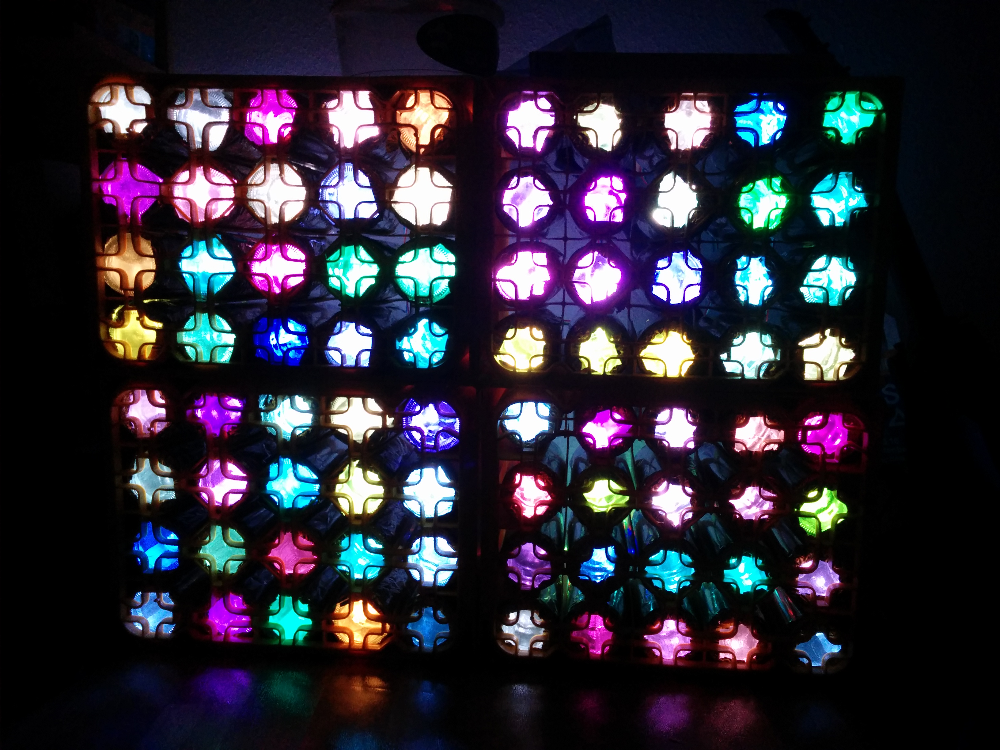
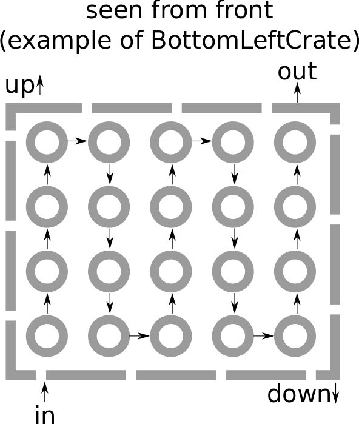

# Matelight
Code for running your very own Matelight! (Under Construction)

# Hardware

The matelight has been created using a number of `WS2801 12 mm RGB LED Strings` and some empty crates of mate (thanks to @hrantzsch for providing some of the empty crates).
The whole thing is powered by an old PC power supply. A Raspberry Pi Model B with Arch Linux Arm handles displaying the data.

## Bottles

Each bottle has been cleaned and wrapped in aluminium foil. We do not use the lid that comes with each bottle, as the
LEDs still stay in each bottle.

## Wiring

We wired each crate in the following way:

This kind of wiring allows us to put all crates together in a nice and intelligent way, that does not include too long wires.
Depending on the location where the input port of the LED strip is we distinguish between the following crate types:
  
  * BottomLeftCrate
  * BottomRightCrate
  * TopLeftCrate
  * TopRightCrate
  
The type of crate is always determined by looking at the bottom of the bottles (the view a user of the matelight has).

# Software

All software we use is written in Python3, using numpy and Pillow as libraries.

## Installation

You can install and run all code on a Raspberry Pi Model B, although installation via pip might take a very long time, so consider using precompiled binaries, if you want to use
a raspberry pi as display controller.
For installation make sure you have Python3 installed on your Raspberry Pi and then just enter `pip install -r requirements.txt` to install all necessary libraries and dependencies.

If you want to run the matelight using our cython interface you will also need to run `python setup.py build_ext --inplace` in the `matelight_controller` directory.

## Usage

This repository contains a script that opens a server listening on a UDP port (default `1337`) for incoming display data.
The incoming data should already have the correct size as specified in the configuration for the display server.
If the data does not have the correct size, the data will be discarded and not displayed.

You can run the server by issuing the following command: `python display_server.py <path to config file>`.
This script only starts the server and does not display anything.

If you want to only test that everything works you may issue the following command `python python_controller.py <path to config file>` in the `matelight_controller` directory.
This script will display random colours for each bottle in the matelight.

If you want to have a more sophisticated program to be displayed on your matelight you can also use `game_of_life.py`.
This script is an implementation of Conway's Game of Life. In order to use this script you will need to install `pymlgame` as additional requirement.
You can install it with `pip install pymlgame`.
You can run the script with the following command: `python game_of_life.py <ip address of matelight server>`.

# License

The software is licensed under the terms of the GPLv3 license. Please note, that non-GPLv3-licensed contents might be part of this repository.
